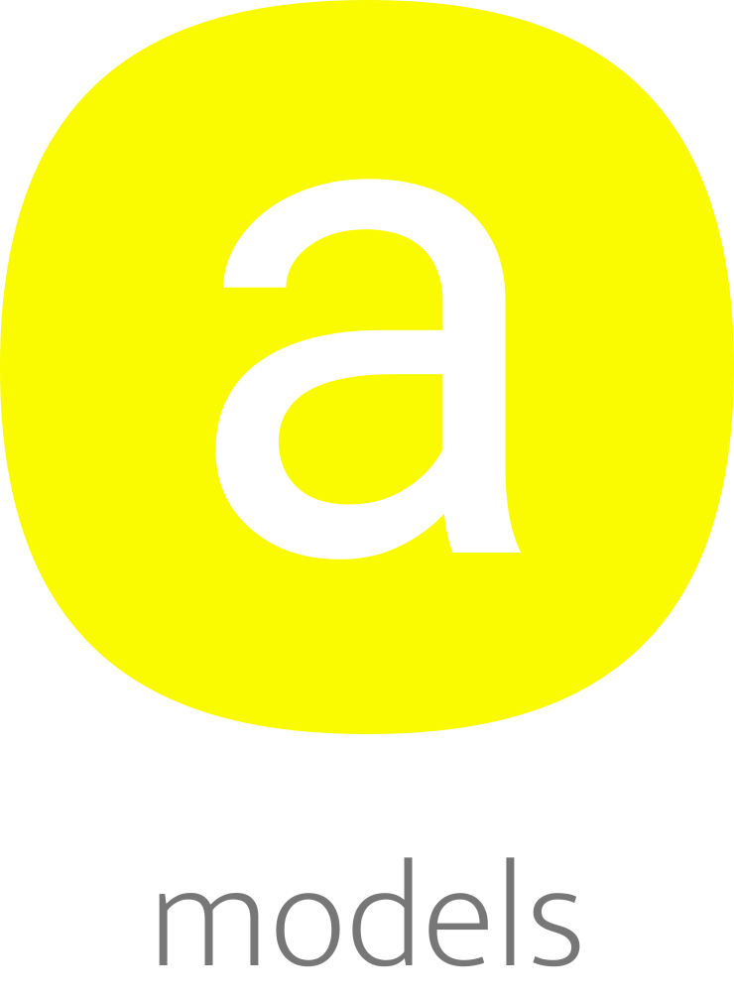

</br >
</br >

<p align='center'>
  <a target='_blank' rel='noopener noreferrer' href='#'>
    
  </a>
</p>

<h1 align='center'>amaui Models</h1>

<p align='center'>
  Models
</p>

<br />

<h3 align='center'>
  <sub>MIT license&nbsp;&nbsp;&nbsp;&nbsp;</sub>
  <sub>Production ready&nbsp;&nbsp;&nbsp;&nbsp;</sub>
  <sub>UMD 4.2kb gzipped&nbsp;&nbsp;&nbsp;&nbsp;</sub>
  <sub>100% test cov&nbsp;&nbsp;&nbsp;&nbsp;</sub>
  <sub>Browser and Nodejs</sub>
</h3>

<p align='center'>
    <sub>Very simple code&nbsp;&nbsp;&nbsp;&nbsp;</sub>
    <sub>Modern code&nbsp;&nbsp;&nbsp;&nbsp;</sub>
    <sub>Junior friendly&nbsp;&nbsp;&nbsp;&nbsp;</sub>
    <sub>Typescript&nbsp;&nbsp;&nbsp;&nbsp;</sub>
    <sub>Made with :yellow_heart:</sub>
</p>

<br />

## Getting started

### Add

```sh
  // yarn
  yarn add @amaui/models

  // npm
  npm install @amaui/models
```

### Use

```javascript
  import express from 'express';
  import { Query, Response } from '@amaui/models';

  async function route(req: express.Request, res: express.Response) {
    const query = Query.fromRequest(req);

    const response = await todoCollection.searchMany(query);

    return res.status(200).json(Response.fromQuery(response));
  }

  // etc.
```

### Dev

Install

```sh
  yarn
```

Test

```sh
  yarn test
```

### Prod

Build

```sh
  yarn build
```
